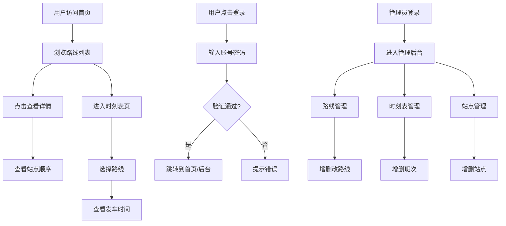

# 校园巴士系统 产品需求文档 (PRD)

## 1. 产品概述

校园巴士在线查询与管理系统，为校园师生提供实时巴士路线、时刻表、站点查询服务，同时为管理员提供路线、班次、站点的后台管理功能。
- **主要目的**：解决校园巴士信息不透明、查询不便的问题，提升校园出行效率
- **目标用户**：在校师生（普通用户）、校园后勤管理人员（管理员）
- **产品价值**：信息透明化、出行便捷化、管理高效化

## 2. 核心功能

### 2.1 用户角色

| 角色 | 注册方式 | 核心权限 |
|------|----------|----------|
| 普通用户 | 用户名密码注册 | 浏览路线、查询时刻表、查看站点、个人信息 |
| 管理员 | 后台预设账号 | 拥有普通用户全部权限 + 路线/班次/站点的增删改管理 |

### 2.2 功能模块

1. **首页/路线查询页**：展示所有巴士路线卡片，支持查看路线详情和站点
2. **时刻表查询页**：按路线筛选查看发车时刻表，按星期/时间排序展示
3. **登录注册页**：用户登录、注册、表单验证
4. **管理员后台页**：路线管理、时刻表管理、站点管理三大模块

### 2.3 页面详情

| 页面名称 | 模块名称 | 功能描述 |
|----------|----------|----------|
| 首页 | 顶部导航栏 | Logo、导航菜单、登录/注册按钮、用户头像下拉 |
| 首页 | Hero 横幅区 | 大标题、搜索框、背景动画效果 |
| 首页 | 路线列表 | 卡片式路线展示，点击展开查看站点顺序 |
| 时刻表页 | 路线选择器 | 下拉选择路线，动态加载对应时刻表 |
| 时刻表页 | 时刻表表格 | 按星期分组展示发车时间，支持时间排序 |
| 登录注册页 | 登录表单 | 用户名、密码输入，记住密码，提交登录 |
| 登录注册页 | 注册表单 | 用户名、密码、确认密码，注册跳转 |
| 管理员后台 | 侧边导航 | 路线管理、时刻表管理、站点管理三个菜单 |
| 管理员后台 | 路线管理 | 路线列表、新增路线、删除路线、编辑路线 |
| 管理员后台 | 时刻表管理 | 时刻表列表、新增班次、删除班次、按路线筛选 |
| 管理员后台 | 站点管理 | 站点列表、新增站点、删除站点、按路线筛选 |

## 3. 核心流程

## 4. 用户界面设计

### 4.1 设计风格
- **主色调**：清新蓝绿色系（#3B82F6 主蓝，#10B981 辅助绿）
- **背景**：浅色渐变背景 + 微妙几何图案装饰
- **按钮风格**：圆角胶囊式按钮，悬停有缩放和阴影动效
- **字体**：标题用 Poppins 无衬线粗体，正文用系统无衬线字体
- **布局风格**：卡片式布局，顶部导航 + 主内容区，响应式栅格
- **图标风格**：线性图标 + 彩色点缀

### 4.2 页面设计概览

| 页面名称 | 模块名称 | UI 元素 |
|----------|----------|---------|
| 首页 | Hero 区 | 渐变背景、大标题动画入场、搜索框发光效果 |
| 首页 | 路线卡片 | 悬浮上移动效、渐变边框、站点展开折叠动画 |
| 时刻表页 | 表格 | 斑马纹、悬停高亮、星期标签彩色 |
| 登录页 | 表单 | 玻璃拟态卡片、输入框聚焦动效、平滑切换 |
| 管理后台 | 侧边栏 | 渐变背景、激活项高亮、图标动效 |
| 管理后台 | 数据表格 | 操作按钮组、确认弹窗、新增表单模态框 |

### 4.3 响应式设计
- **桌面端优先**（1200px+）：完整三栏/两栏布局
- **平板端**（768-1199px）：侧边栏折叠，卡片自适应宽度
- **移动端**（<768px）：汉堡菜单，单列布局，触控优化按钮尺寸

### 4.4 动效设计
- 页面切换：淡入 + 向上滑动
- 卡片悬停：translateY(-4px) + 阴影加深
- 按钮点击：scale(0.97) 反馈
- 数据加载：骨架屏 + 渐显
- 模态框：缩放淡入
