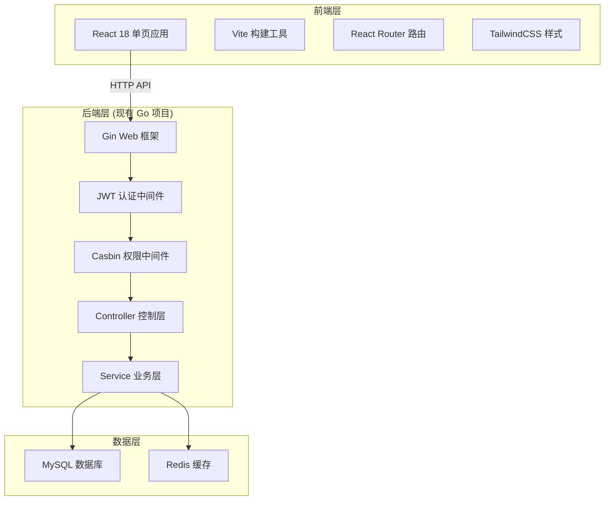
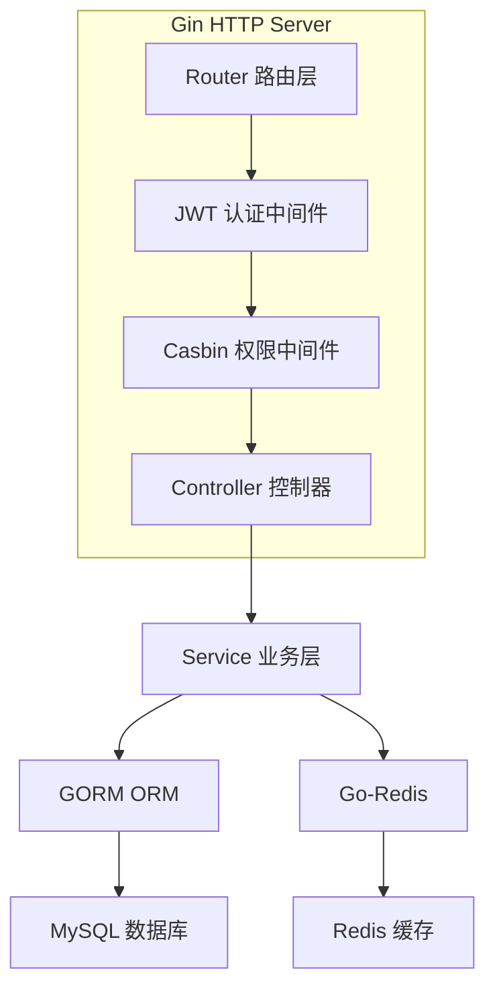
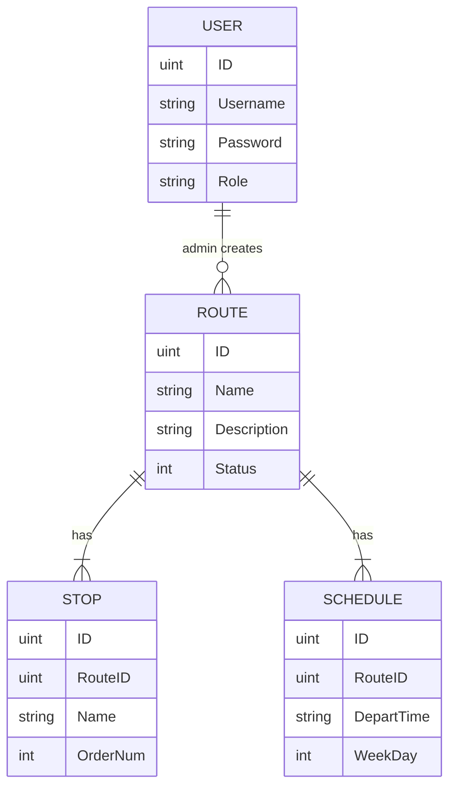

# 校园巴士系统 技术架构文档

## 1. 架构设计



## 2. 技术选型说明

- **前端框架**：React 18 + Vite
  - 组件化开发，便于维护
  - Vite 构建速度快，开发体验好
- **路由**：React Router v6
  - 客户端路由，SPA 体验流畅
- **样式方案**：TailwindCSS 3
  - 原子化 CSS，开发效率高
  - 主题配置灵活
- **状态管理**：React Context + localStorage
  - 轻量级，满足当前需求
  - 用户信息持久化存储
- **HTTP 请求**：Axios
  - 拦截器统一处理 token 和错误
- **图标库**：Lucide React
  - 现代化线性图标，风格统一

## 3. 路由定义

| 路由路径 | 页面组件 | 权限要求 | 说明 |
|----------|----------|----------|------|
| `/` | HomePage | 公开 | 首页，展示路线列表 |
| `/schedules` | SchedulePage | 公开 | 时刻表查询页 |
| `/login` | LoginPage | 公开 | 登录注册页 |
| `/admin` | AdminLayout | 管理员 | 管理后台布局页 |
| `/admin/routes` | AdminRoutesPage | 管理员 | 路线管理 |
| `/admin/schedules` | AdminSchedulesPage | 管理员 | 时刻表管理 |
| `/admin/stops` | AdminStopsPage | 管理员 | 站点管理 |

## 4. API 接口定义

### 4.1 认证接口

```typescript
// POST /api/v1/register
interface RegisterRequest {
  username: string;  // 3-20 chars
  password: string;  // min 6 chars
}
interface RegisterResponse {
  message: string;
}

// POST /api/v1/login
interface LoginRequest {
  username: string;
  password: string;
}
interface LoginResponse {
  token: string;  // JWT token
}

// GET /api/v1/users/profile
interface ProfileResponse {
  username: string;
}
```

### 4.2 路线接口

```typescript
// GET /api/v1/routes
interface Route {
  ID: number;
  Name: string;
  Description: string;
  Status: number;  // 1:运行中, 0:停运
  CreatedAt: string;
  UpdatedAt: string;
}
type GetRoutesResponse = Route[];

// POST /api/v1/routes (admin only)
interface CreateRouteRequest {
  name: string;
  description?: string;
}
interface CreateRouteResponse {
  message: string;
}
```

### 4.3 时刻表接口

```typescript
// GET /api/v1/schedules?route_id=1
interface Schedule {
  ID: number;
  RouteID: number;
  DepartTime: string;  // "HH:mm"
  WeekDay: number;     // 0=每天, 1-7=周一至周日
}
type GetSchedulesResponse = Schedule[];

// POST /api/v1/schedules (admin only)
interface CreateScheduleRequest {
  route_id: number;
  depart_time: string;
  week_day: number;
}

// DELETE /api/v1/schedules/:id (admin only)
interface DeleteScheduleResponse {
  message: string;
}
```

### 4.4 站点接口

```typescript
// GET /api/v1/stops
interface Stop {
  ID: number;
  RouteID: number;
  Name: string;
  OrderNum: number;
}
type GetStopsResponse = Stop[];

// POST /api/v1/stops (admin only)
interface CreateStopRequest {
  route_id: number;
  name: string;
  order_num: number;
}
```

## 5. 后端服务架构



## 6. 数据模型

### 6.1 ER 图



### 6.2 初始数据（Mock 数据）

为了前端开发和演示，提供以下 mock 数据：

**路线数据：**
- 1号线：教学楼 ↔ 图书馆（途经：南门、食堂、体育馆）
- 2号线：东区宿舍 ↔ 西区教学楼（途经：东门、实验楼、艺术楼）
- 3号线：地铁口 ↔ 校园中心（途经：北门、行政楼、活动中心）

**时刻表数据：**
- 每条路线工作日每30分钟一班
- 早高峰 7:00-9:00，晚高峰 17:00-19:00 加密班次
